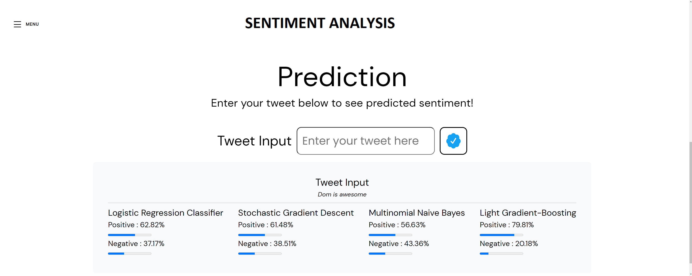

# Tweet-Sentiment-Predictor

# Contributors (Group 5)

- Brandon Groenewold
- Sanoo Singh
- Jon Kwiatkowski
- Nhan Tran
- Adrian Wood

# Datasets

- [Kaggle](https://www.kaggle.com/datasets/kazanova/sentiment140) 

- [Original](https://drive.google.com/file/d/1ML1sG56MqlVX6oiNM4WDtPC3AFOO06y0/view?usp=share_link)

- [Cleaned](https://drive.google.com/file/d/1RgRj4J9FJZ0YYN36nSx-umP9eZNPff94/view?usp=share_link)  

- [Lemmatize](https://uom-twitter-sentiment-analysis.s3.us-east-2.amazonaws.com/Lemmatize.csv) 

# Imports

- pandas
- numpy
- NLTK
- string
- re
- dump
- RegexpTokenizer
- stopwords
- TfidfVectorizer
- train_test_split
- MultinomialNB
- confusion_matrix
- f1_score
- GridSearchCV
- SGDClassifier
- LogisticRegression
- LGBMClassifier

# Resources 
- https://medium.com/mlearning-ai/how-to-deploy-an-nlp-machine-learning-model-with-flask-on-web-788c2825b792
- https://github.com/conda-forge/lightgbm-feedstock
- https://github.com/javedsha/text-classification
- https://towardsdatascience.com/create-word-cloud-into-any-shape-you-want-using-python-d0b88834bc32

# Instructions
- Clone this repo to your computer
- Run app.py 
- Type in your tweet into the Tweet Input box to see the prediction results

# Major Tasks
- Apply ETL on the dataset
- Preprocessing
- Split Cleaned Data into Training Set and Testing Set
- Train the Models
- Saving the Vectorizer and Models
- Make Predictions
- Create Word Collage
- Build the website using HTML/CSS
- Build the flask server
- Host the website on Heroku 

# Project Objective

We will use datasets to create a model with (various) features that will predict whether a tweet is positive or negative. Using Pandas, AWS, HTML/CSS/JS/Bootstrap, and NLTK they will be ranked and weighted to see which way they get classified.

# Project Summary 

The goal of this project was to see if it was possible to train a machine learning model to recognize the sentiment of a tweet. We began by discussing possible limitations. In the end, we wanted to host this model on Heroku. Since Heroku only supports scikit-learn models, we were unable to use PySpark or Tensorflow. However, we found that NLTK offers the same functionality and would work with Heroku. NLTK is a platform for building Python programs to work with human language data. It contains a suite of text processing libraries for classification, tokenization, lemmatization, etc.

### We built a processing pipeline with the following steps:

- Removing Punctuation - Since we were dealing with tweets, there were a host of punctuation marks we chose to eliminate. In today’s language, emoticons such as ‘:D’ could actually yield some sort of sentiment. However, as there were many other unnecessary punctuation marks, we chose to eliminate all of them.
Tokenizing - This key step in the pipeline separates words so that each can be analyzed individually, usually by whitespace but in certain situations, a contraction such as I’m needs to be separated into the two words I am.
Removing Stop Words - Stop words are common words that hold no sentiment and are thus unnecessary in training the model. Examples of stop words include: ‘a,’ ‘and,’ ‘or.’ 

- Lemmatization - This step identifies when two words have the same root and maps them to one word. For example: ‘code,’ ‘coding,’ ‘codes,’ and ‘coded’ will all get mapped to ‘code.’
Vectorization - This final step maps each word to a numerical value.

- The preprocessing took quite a bit of time. In total, it took almost three hours to run our data through steps 1-4 of the pipeline. To avoid doing these steps again, we saved the preprocessed data so that we could easily call it later. Then began training our models. At this step, we vectorized the data, which maps each word to a numerical value, and split the data into a training set and a testing set.

- We chose four different types of models. However, they all had a few things in common that made them ideal choices for our project. They all did well with text classification in general and they were all very fast. Since our dataset consisted of 1.6 million tweets, speed was important. The first model we chose was the Multinomial Naive Bayes Classifier (NBC). Initially, we obtained a score of about 76.5% on the test set. Then, we chose the Stochastic Gradient Descent (SGD) model which scored about 76%. Next, we chose the Logistic Regression Classifier (LRC) which scored about 78.3%. Finally, we tried the Light Gradient Boosting (LGB) model and obtained a score of about 66%. After performing a grid search on each model,  we were able to increase the testing score of the SGD model to about 78.4% by adjusting the alpha parameter. This gave it a slight edge over the LRC model, currently our best performer. We were unable to increase the scores for any of the other models.

- Next we saved our vectorizer and each model so that they could be deployed to Heroku. We began with our two best-performing models (SGD and LRC) keeping in mind the size restrictions that Heroku imposes. The fact that these models performed best makes sense. Even considering our huge dataset, the zero-frequency problem is still an issue with the NBC model and the excess noise is still an issue for the LGB model. However, after finding out that the models were rather small and we had plenty of space to work with, we decided to include them all.

- Finally, we started making some predictions. We ran into three problems:

- The probabilities wouldn’t display for the SGD model. We found that the ‘predict_proba’ attribute couldn’t be used when we used ‘hinge’ for the ‘loss’ parameter. Although this was determined by our grid search to be the best parameter, we actually didn’t lose any accuracy by changing it to ‘log.’ This cleared up that error.
For some reason, the displayed percentages wouldn’t round properly in certain fringe cases. We were unable to figure out why, but we were able to convert each value in the float to a string, then select the first five values. For example 29.45 would be the first five values for 29.45348576. This affects the rounding of the hundredths place in some cases but we could always include more decimal places if need be. The important part was getting the values to display in a consistent way.
When we input a tweet that was completely removed in the preprocessing pipeline, it caused the prediction to fail. For example, since we removed all punctuation, a tweet such as ‘:D’ would be completely removed. Similarly, a list of only stop words such as ‘and or a’ would be completely removed. This meant that there was nothing left to vectorize which broke the prediction. To remedy this, we used Try/Except around the vectorizer which prompted the user to enter a new tweet if such a situation occurred.

# Results

After training and testing is concluded, there should be four Models (Logistic Regression Classifier, Stochastic Gradient Descent, Multinomial Naive Bayes, Light Gradient-Boosting) that can formulate Predictions. These are able to identify positive and negative tweets from a dataset. These models can be used with new information and can make a  determination on new entered  tweets and decide if the tweet is positive or negative with increasing levels of accuracy. The models can now be used with any new tweets collected  in the future for farther development.

# Landing Page

# Trained Models

- Stochastic Gradient Descent: Gradient descent is an optimization algorithm that attempts to minimize a cost function. However, each iteration of gradient descent runs through the entire datasets searching for an optimal solution. Stochastic gradient descent  makes this process a bit faster. It shuffles the data to avoid any pre-existing patterns, divides it into a finite number of subsets. Each iteration is then performed on an individual subset rather than the entire dataset. This makes  regular gradient descent but can result in a higher variance. 

- Light Gradient Boosting: Gradient boosting is a model based on decision trees. However, unlike Random Forests where trees are built independently, gradient boosted trees are built additively. That is, they correct the errors of the trees that came before. This leads to faster training times, lower memory usage, and higher accuracy working with complex data. This makes LGB ideal for very large data sets. However, they are far more susceptible to noise.

- Logistic Regression: Logistic regression is an algorithm that classifies data by considering extreme outcomes and tries to make a logarithmic line that distinguishes between them. Logistic models are simple and provide great efficiency. However, they’re not as flexible as other models so it’s difficult for them to capture more complex relationships.

- Multinomial Naive Bayes: Naive Bayes classifier makes use of Bayes’s Theorem which describes the relationship between conditional probabilities  of certain quantities. This lets us find the probability of a label given some observed features. Multinomial Naive Bayes takes this a step further by analyzing how often a given term is represented. This model is well-suited for large data sets because it is so fast. The biggest downfall of this model is known as the zero-frequency problem. That is, it assigns a probability of zero to a categorical value that is present in the testing set but wasn’t available in the training set.

# Word Cloud Description

A word cloud is a Visualization of a text meant to help understand information at a glance. It is a word image where each word's size is proportional to its importance, the more often it's mentioned within a given text words appear larger.

Being able to see the tweet information was helpful during the training and testing of the models. After looking at the word clouds you could see there are some words that are used in both positive and negative tweets such as "I'm". This could be caused by people using it in both instances such as "I'm happy" and "I'm sad".

# Word Cloud for positive tweets

upon looking at the word clouds with positive tweets, we found that some of the positive words were a little out of the ordinary like "kackered" and some random numbers. Some of these might have been able to make it in the positive words based on the words around them or the whole feel of the tweet, Other than the words themself.

# Word Cloud  for negative tweets

Just like with the positive tweets some of the words the models considered negative were somewhat surprising such as "cool" or "hope". Words that normally have a positive sentiment. After discussing it with the group, we concluded that some of these words might have made it in the negative tweets because they could have been used to express expectations that might not have been met.

